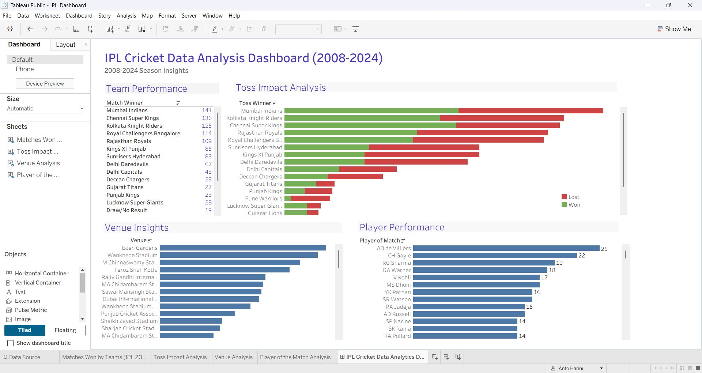

# 🏏 IPL Cricket Data Analytics Dashboard (2008–2024)

## 📊 Project Overview
This project is an interactive data analysis of the Indian Premier League (IPL) from 2008 to 2024.  
It explores team performance, toss impact, venue statistics, and player performance using Tableau.

The goal of this project is to derive meaningful insights from IPL match data and present them visually through an interactive dashboard.

---

## 🛠 Tools Used
- Tableau (Data Visualization)
- Microsoft Excel (Data source handling)

---

## 📈 Key Insights
- Most successful IPL teams based on total match wins
- Impact of winning the toss on match outcomes
- Top IPL venues based on number of matches hosted
- Players with the most "Player of the Match" awards

---

## 📊 Dashboard Preview

---

## 🔗 Live Dashboard (Tableau Public)
Click below to view the interactive dashboard:
[View Interactive Dashboard](https://public.tableau.com/views/IPL_Dashboard_17809834738800/IPLCricketDataAnalyticsDashboard2008-2024?:language=en-US&:sid=&:redirect=auth&:display_count=n&:origin=viz_share_link)

---

## 📁 Project Files
- Tableau Workbook (.twbx)
- Dashboard screenshots (.png)
- README documentation

---

## 🎯 Purpose of the Project
This project was created to improve my data analytics skills and gain hands-on experience in:
- Data visualization
- Dashboard creation
- Business insight generation using sports data

---

## 🚀 Future Improvements
- Adding advanced filters (season-wise analysis)
- Player performance deeper analysis
- Predictive analytics using machine learning (future scope)

---

## 📌 Author
Created as a personal data analytics project on IPL cricket data.
